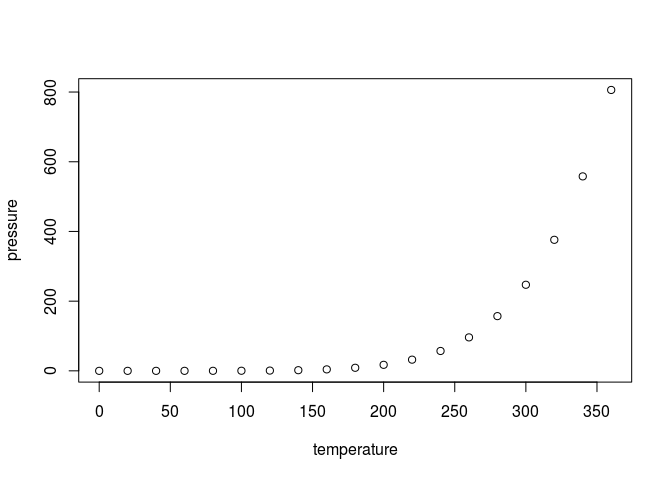

# Fingerprints
Guillermo Basulto-Elias  
March 28, 2016  


## Database description


We start by describing the database that we are going to use in this work, that is, the NIST Special Database 4 will be used in this work. The description was obtained from [something](http://www.nist.gov/srd/nistsd4.cfm). This database contains good images of fingerprints, which seems to be a good idea to start playing with algorithms and data processing. 

The database contains 4000 $512\times512$ pixels images, 32 rows at the bottom of each image is a white band. There are two images of the finger and there are five classes of fingerprints evenly distributed, such categories are arch, left and right loops, tented arch and whirl. Thus, there are 400 pairs of images for each of these categories. The fingerprint type and subject's gender are included in a text file named after the .png file.

## R Markdown

This is an R Markdown document. Markdown is a simple formatting syntax for authoring HTML, PDF, and MS Word documents. For more details on using R Markdown see <http://rmarkdown.rstudio.com>.

When you click the **Knit** button a document will be generated that includes both content as well as the output of any embedded R code chunks within the document. You can embed an R code chunk like this:


```r
summary(cars)
```

```
##      speed           dist       
##  Min.   : 4.0   Min.   :  2.00  
##  1st Qu.:12.0   1st Qu.: 26.00  
##  Median :15.0   Median : 36.00  
##  Mean   :15.4   Mean   : 42.98  
##  3rd Qu.:19.0   3rd Qu.: 56.00  
##  Max.   :25.0   Max.   :120.00
```

## Including Plots

You can also embed plots, for example:



Note that the `echo = FALSE` parameter was added to the code chunk to prevent printing of the R code that generated the plot.
